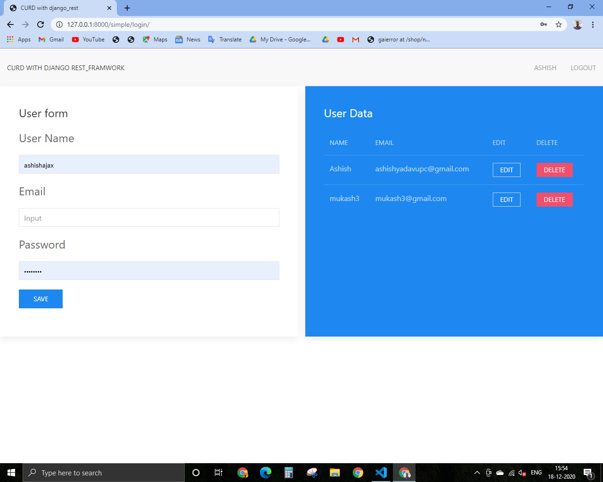

# CURD API With Django Rest_Framwork
# Introduction
This **CURD API** is created in django rest_framwork. In this application there are two app. one app provide functionality of CURD API. In this API show haw data read, write, delete or get data of one user.Django rest_framwork is very fast and simple framwork for creating api. In this application the simple app communicate with api app . That send request with requets module. The simple app have no any database. This app send data to api so api save data  or send data when simple app send request. The API prvide authentication. when user authenticate then he perform action otherwise api send information unauthorised user.

# Screenshot

# Files and Folder in this application
 * **serializer:** This file contain model base serializer that name is **userserializer**. The Serializer convert complex data like model instance in python data.
 * **api/views:**  This file contain **class based generic views**. Generic views provide list,retrive,update,destroy APIView. With use generic views required very fiew code.
 * **api/urls:** This file contain api related urls.
 * **customauthentication:** This file contain custom authentication code. when user is auctenticate the return user instance.
 * **simpleapp/views:** This is contain django fuction based views. That execute after http request. This contain login,register,getdeatils,update,delete,logout views.
 * **simpleapp/urls:** This file contain simpleapp related urls. like login,register,getdetails, update, delete,logout.

 * **templates folder** This folder contain login.html or home.html file .
 * **Settings:** This is the main file of django app. This is contain configuration system like all install app , database, middleware,templates etc.
 * **models:** This is contain blueprint of all database table in python class.This is not contain any code. In this application user django auth **user** model.

 * **admin:** Django provide default admin page so it is required to register this models inside admin file or also provide features to filter,search, show coloum ect.
  * __init__: It is describe it is a python package.
  * **Pycache:** This is contain byte code after complitation of python code.
  * **migration folder:** This is contain blueprint of table in code formate after migrate command it is apply on actual database table.
  * **manage:** Django's command-line utility for administrative tasks. runserver, makemigration, migrate, createsuperuser etc.

  # Features of Curd api djangorest
   * create,update,retrive,delete operation in django rest_framwork.
   * Haw to create api with help of django rest_framwork.
   * Haw to authenticate with custom acthentication.
   * Haw django app communicate with django rest_api.
 # Refrence
  * [Django Rest_framwork Documentaion](https://www.django-rest-framework.org/)
  * [Django Documentaion](https://docs.djangoproject.com/en/3.1/) 
